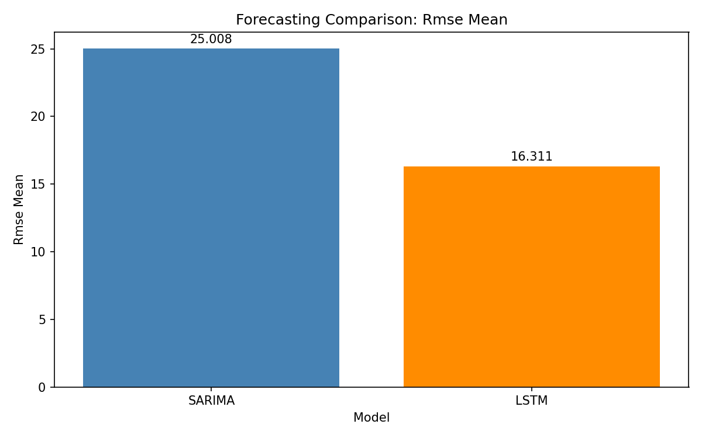
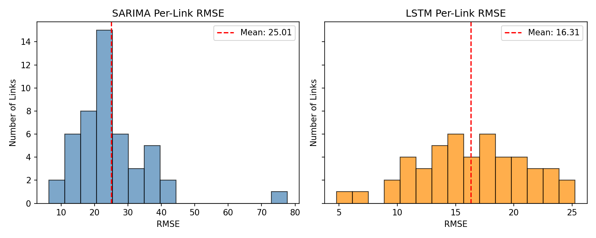
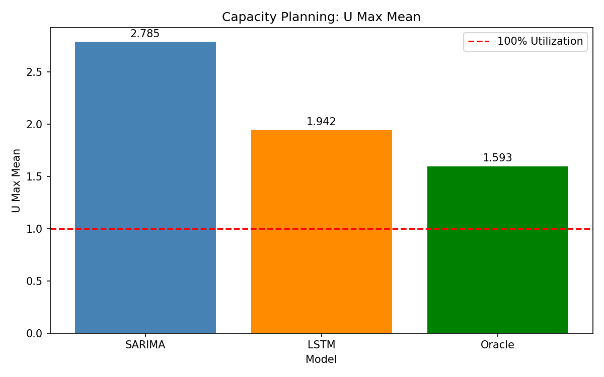
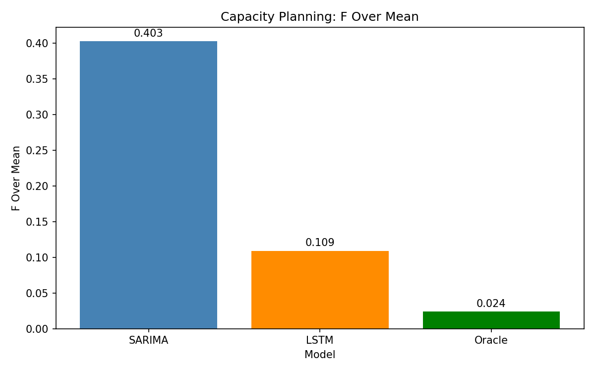
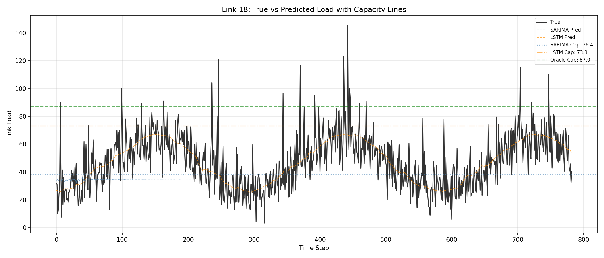

# Network Traffic Forecasting & Capacity Planning

Compare SARIMA vs LSTM models for link load prediction in a synthetic backbone network, and evaluate how forecasting quality affects capacity planning decisions.

## Overview

This project implements a complete simulation pipeline to:
1. Generate synthetic network traffic on a 12-node backbone topology
2. Train SARIMA (per-link) and LSTM (joint) forecasting models
3. Evaluate forecasting accuracy (RMSE, MAE, MAPE)
4. Analyze capacity planning implications (utilization, overload rates)

## Quick Start

```bash
# Create virtual environment
python3 -m venv venv
source venv/bin/activate

# Install dependencies
pip install -r requirements.txt

# Run full pipeline
python main.py
```

## Project Structure

```
├── config.py           # Global configuration parameters
├── utils.py            # Shared utility functions
├── simulate_data.py    # Synthetic data generation
├── train_arima.py      # SARIMA model training
├── train_lstm.py       # LSTM model training
├── eval_capacity.py    # Evaluation and capacity planning
├── main.py             # Pipeline orchestrator
├── requirements.txt    # Python dependencies
├── data/               # Generated data files
├── models/             # Trained model artifacts
├── results/            # Metrics and predictions
└── plots/              # Visualization outputs
```

## Configuration

Key parameters in `config.py`:

| Parameter | Value | Description |
|-----------|-------|-------------|
| `num_nodes` | 12 | Network nodes |
| `days` | 14 | Simulation duration |
| `time_step_minutes` | 5 | Sampling interval |
| `window_size` | 24 | LSTM input window (2 hours) |
| `arima_order` | (2,1,2) | ARIMA order |
| `seasonal_order` | (1,0,1,72) | SARIMA seasonal (6-hour period) |
| `capacity_margin` | 1.1 | 10% safety margin |

## Results

### Forecasting Metrics

| Model | RMSE | MAE | MAPE |
|-------|------|-----|------|
| SARIMA | 25.01 | 19.99 | 44.6% |
| LSTM | **16.31** | **12.08** | **25.4%** |

<p align="center">
  
  
</p>

### Capacity Planning

| Model | Mean U_max | Mean Overload |
|-------|------------|---------------|
| SARIMA | 2.79 | 40.3% |
| LSTM | 1.94 | 10.9% |
| Oracle | 1.59 | 2.4% |

<p align="center">
  
  
</p>

**Key Finding**: LSTM's better forecasting accuracy translates to significantly lower capacity over-provisioning and reduced overload events compared to SARIMA.

### Example: Link Time Series

<p align="center">
  
</p>

## Usage Options

```bash
# Full pipeline
python main.py

# Skip data generation (reuse existing)
python main.py --skip-data

# Only run evaluation
python main.py --eval-only

# Run individual scripts
python simulate_data.py
python train_arima.py
python train_lstm.py
python eval_capacity.py
```

## Generated Outputs

- **Data**: `data/topology.npz`, `data/traffic_data.npz`
- **Model**: `models/lstm_forecaster.pt`
- **Metrics**: `results/combined_results.json`
- **Plots**: `plots/*.png` (histograms, comparisons, time series)

## Requirements

- Python 3.9+
- numpy, pandas, networkx
- matplotlib, statsmodels
- torch, scikit-learn, joblib
